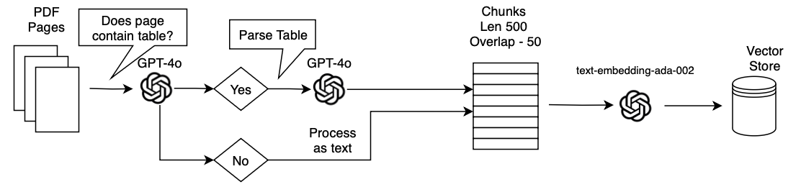

# Visual RAG Benchmark

**An end-to-end evaluation of retrieval-augmented generation on reference tables, and a framework for closing the text-table performance gap.**

RAG systems rely on semantic similarity between query embeddings and document chunk embeddings. This assumption holds well for continuous prose, but it is called into question when applied to structured data, and to reference tables in particular. Tables encode information through two-dimensional layouts in which row-column intersections carry meaning that cannot be preserved through linear text serialisation. Standard document processing pipelines, optimised for continuous prose, compound the problem: character-based chunking algorithms have no awareness of table boundaries and frequently split a table across several chunks, destroying the spatial relationships on which comprehension depends.

The practical impact extends beyond academic interest. In regulatory compliance, financial analysis and scientific research, critical information is frequently encoded in tables, and RAG implementations across these industries are transitioning from experimental to business critical. The trust users place in these systems, stemming from their apparent grounding in authoritative sources, lends particular urgency to the problem.

In this work we assess the ability of a RAG system to answer both text-based and table-based questions, demonstrate the degraded performance that standard implementations exhibit on tabular data, and evaluate a range of methods aimed at improving it. By combining per-page image embedding with multimodal chain-of-thought prompting we achieve an improvement from **48.9% to 84.4%** correctness on table-based questions, a gain of 35.5 percentage points, while text-based performance is maintained and slightly improved.

<p align="center">
  
</p>

---

## Motivation

Current evaluation frameworks for RAG predominantly use benchmark datasets derived from textual knowledge bases such as Wikipedia. TriviaQA, HotpotQA and PopQA have all risen to prominence and been adopted widely in the literature. While these benchmarks evaluate performance on continuous text effectively, they do not capture the challenges posed by structured data, and this evaluation gap has resulted in a systematic underestimation of performance degradation on real-world corpora containing mixed content types.

Where multimodal RAG has been studied, most existing work approaches visual content as a monolithic category, treating images, diagrams, charts and tables with uniform methodologies. At the very least this obfuscates table performance within a broad result. Furthermore, most existing work focuses on retrieval accuracy in isolation, reporting nDCG@5 against query-page benchmarks such as ViDoRe, and leaves the task of ultimately answering the question unaddressed. To the best of our knowledge, we are the first to take a table-focused approach to RAG evaluation from an end-to-end perspective.

---

## Results

Correctness is measured using LLM-as-a-judge, following Zheng et al. The question, the true answer and the generated answer are passed to a judge model prompted to return "Y" or "N". We were careful not to use the same model for generation and judgement, so as to prevent bias. When compared against human evaluation the approach produced almost identical scores, which gave us confidence in treating it as our primary metric. We supplement it with ROUGE-1, scaled to 100 to make comparison more natural, and with retrieval accuracy, a binary measure per question of whether the correct page or table appeared among the returned documents.

| Method | Correctness TextQA | Correctness **TableQA** | ROUGE-1 Text | ROUGE-1 Table | Retrieval Text | Retrieval Table |
|---|---|---|---|---|---|---|
| Chunked Text *(baseline)* | 73.2 | **48.9** | 61.7 | 42.6 | – | – |
| &nbsp;&nbsp;+ CoT | 69.6 | 53.3 | 62.7 | 50.6 | – | – |
| Chunked Markdown | 67.9 | 55.6 | 60.3 | 50.4 | – | – |
| &nbsp;&nbsp;+ CoT | 67.9 | 55.5 | 60.8 | 55.9 | – | – |
| Per-Page Text | 67.9 | 60.0 | 62.1 | 55.9 | 62.5 | 82.2 |
| &nbsp;&nbsp;+ CoT | 67.9 | 71.1 | 61.3 | 66.3 | | |
| Per-Page Markdown | 69.6 | 68.9 | 66.7 | 63.0 | 66.1 | 80.0 |
| &nbsp;&nbsp;+ CoT | 69.6 | 73.3 | 64.2 | 69.0 | | |
| Table Captioning | 64.3 | 62.2 | 62.0 | 58.2 | – | 80.0 |
| &nbsp;&nbsp;+ CoT | 62.5 | 64.4 | 61.3 | 62.9 | | |
| Dual Text-Image Framework | **80.4** | 77.8 | 72.3 | 75.4 | – | 89.9 |
| &nbsp;&nbsp;+ CoT | 78.6 | 75.6 | 71.6 | 74.6 | | |
| &nbsp;&nbsp;+ MM CoT | 73.2 | 73.3 | 70.3 | 73.5 | | |
| **Per-Page ColPali** | 76.7 | 80.0 | **72.5** | 76.1 | **83.9** | **91.1** |
| &nbsp;&nbsp;+ CoT | 71.4 | 77.8 | 67.8 | 79.7 | | |
| &nbsp;&nbsp;**+ MM CoT** | 78.6 | **84.4** | 71.1 | **81.4** | | |

*Retrieval accuracy is omitted for the CoT variants, as prompting alters generation rather than retrieval and the figures remain identical to their non-CoT counterparts. Results are across the 103-question evaluation set described below: 56 text, 45 table and 2 diagram.*

Thirteen of the sixteen rows above recompute exactly from the raw evaluation runs committed to `results/runs/`, which map onto the paper's method names as follows. Three CoT variants were not preserved.

| Paper method | Run file |
|---|---|
| Chunked Text *(baseline)* | `simple_text_n103` |
| &nbsp;&nbsp;+ CoT | `simple_text_cot_n103` |
| Chunked Markdown | `simple_markdown_n103` |
| Per-Page Text | `per_page_text_n103` |
| &nbsp;&nbsp;+ CoT | `per_page_text_cot_n103` |
| Per-Page Markdown | `per_page_markdown_n103` |
| &nbsp;&nbsp;+ CoT | `per_page_markdown_cot_n103` |
| Table Captioning | `multi_modal_descriptions_n103` |
| &nbsp;&nbsp;+ CoT | `multi_modal_descriptions_cot_n103` |
| Dual Text-Image | `chunked_copali_n103` |
| &nbsp;&nbsp;+ MM CoT | `chunked_copali_cot_n103` |
| Per-Page ColPali | `full_n103` |
| &nbsp;&nbsp;+ MM CoT | `full_cot_n103` |

```bash
python scripts/summarise_results.py    # recomputes every figure above
```

### Discussion

The first result in the table justifies the work. Performance of a baseline RAG system on table-based questions is clearly degraded, showing a significant 24.3 percentage point difference when compared with equivalent text-based questions over the same corpus, with the same retriever and the same generation model.

Converting documents to markdown in order to preserve table structure is a natural first response to this problem, and it is only partially effective. Chunked markdown improves table correctness by 6.7 points over the baseline but costs 5.3 points on text, as the conversion degrades continuous prose while only partly rescuing tabular content. Moving from chunks to whole pages proves more productive than changing the text format, which is consistent with our expectation that a chunk boundary falling through a table is considerably more damaging than one falling within a paragraph.

The standout performances of the ColPali-based implementations are clear from these results. Every image-based variant outperforms every text-based variant on table questions. Embedding the page as an image avoids text parsing altogether, so the two-dimensional structure of the table survives intact through to the generation model, and the retrieval figures support this: 91.1% of table questions retrieved the correct page, against 82.2% for per-page text. The per-page image-only method exhibits the best overall performance against our stated objective of improving correctness on table-based questions without degrading text performance.

Chain-of-thought prompting interacts with modality in a way we found instructive. CoT degrades the text baseline, from 73.2 to 69.6, but improves every table-based method, and does so most strongly where the retrieved evidence is an image. The sequential nature of CoT reasoning, identifying the relevant table, locating specific rows and columns, and extracting the target value, aligns naturally with the reasoning that table comprehension demands. The combination of ColPali embedding with multimodal chain-of-thought produced the strongest table result in the study at 84.4%, whilst maintaining and even slightly improving the text-based score by 5.4 percentage points.

We note one result that runs against the intuition that combining modalities should dominate either one alone. The Dual Text-Image Framework achieves the best text correctness in the study at 80.4, but is beaten on table questions by the simpler image-only method. We attribute this to the modality gap: the text branch draws the retriever toward prose passages even in cases where the answer resides in a table.

---

## Dataset

Addressing the research gap described above presented an initial hurdle, in that no existing dataset was designed for this task. Several were considered. DocVQA assumes visual elements are already present alongside the question, with queries such as "What date is seen at the top of the letter" that do not translate to a RAG framework where the document must first be retrieved. InfoVQA contains an insufficient number of tables for comprehensive evaluation. TabFQUAD consists primarily of captioned tables, making it suitable for retrieval but inadequate for question answering. We acknowledge that TAT-QA could have served as a viable alternative, though it was discovered too late in the project timeline to incorporate effectively.

As a central aspect of this project is addressing the table-text gap from the perspective of an organisation implementing RAG over a fresh document corpus, it seemed apt to create a new dataset from raw documents rather than work with pre-curated collections of text chunks and tables.

We identified the EU Water Framework Directive as an excellent source. Its website publicly hosts 38 guidance documents totalling 3888 pages. We narrowed this to three documents, selected specifically for their high concentration of complex reference tables and amounting to 568 pages:

- *Environmental standards phase 2_Final_110309.pdf*
- *Guidance No 01 - Economics - WATECO (WG 2.6).pdf*
- *Guidance No 27 - Deriving Environmental Quality Standards - version 2018-1.pdf*

A semi-synthetic generation approach was used to build the QA pairs. A purpose-built utility (`src/utils/question_creation_app_v2.py`) processes each document page by page, passing the content to an LLM prompted to produce questions answerable from that page with concise answers of one to five words. Each generated pair was then reviewed and manually accepted, edited or discarded. This accelerated question creation considerably whilst retaining manual review as a quality control mechanism to minimise bias. We took particular care to ensure that table-based questions could not be answered from other textual content within the documents, so as to maintain the integrity of the table-specific evaluation.

Every question records the page it was drawn from and the type of evidence required to answer it, which is what allows text and table performance to be reported separately:

```json
{
  "question": "Where are the programmes of measures defined for each basin district?",
  "answer": "River Basin Management Plans",
  "ground_truth_source": {
    "type": "text",
    "document": "Guidance No 01 - Economics - WATECO (WG 2.6).pdf",
    "page": 9
  }
}
```

Two sets are committed:

| File | Questions | Composition | Used for |
|---|---|---|---|
| `benchmark/paper_question_set.json` | 103 | 56 text, 45 table, 2 diagram | the published results above |
| `benchmark/question_set.json` | 154 | 75 text, 77 table, 2 diagram | later extension, more table-weighted |

> **A note on the paper's footnote.** Table 1 of the paper describes the evaluation as covering "104 TextQA and 101 TableQA questions". That figure is an error: the set actually evaluated is the 103 questions above, as the committed runs confirm — every per-method figure recomputes from them exactly. The 154-question set was assembled afterwards to rebalance the split toward tables, and the method ordering is unchanged on it, though absolute figures move by a point or two.

---

## Methods

Each method is implemented as a `VectorStorePipeline` subclass in `src/build_vector_stores.py`, paired with a corresponding agent in `src/agents.py`.

| Method | Indexing | Retrieval unit |
|---|---|---|
| Chunked Text | PyMuPDF text extraction, recursive chunking | text chunk |
| Chunked Markdown | `pymupdf4llm` markdown conversion, chunked | markdown chunk |
| Per-Page Text | text extraction, no chunking | whole page |
| Per-Page Markdown | markdown conversion, no chunking | whole page |
| Table Captioning | VLM-generated prose description of each detected table | caption and source |
| Dual Text-Image | parallel text and ColPali image stores, merged | page and chunk |
| Per-Page ColPali | ColPali multi-vector embedding of the page image | page image |

ColPali requires a GPU, which is not generally available on a laptop. `src/colab_api.py` is a FastAPI service that exposes the embedding model over ngrok so that it can be driven from a Colab GPU runtime, with `src/copali_api_interface.py` acting as the client. `src/copali_lancedb_vector_store.py` stores the multi-vector embeddings in LanceDB and implements MaxSim late-interaction scoring.

---

## Results data

Raw per-question output for 26 evaluation runs is held in `results/runs/`, one file per method and prompting variant, over both the 103- and 154-question sets. Each record retains the question, the ground truth, the generated answer, the judge's verdict and its similarity score; the later runs additionally retain the retrieved documents. Any figure can therefore be recomputed, and any individual failure inspected.

```bash
python scripts/summarise_results.py                          # recompute correctness for every run
python scripts/summarise_results.py --failures simple_text   # inspect what the baseline got wrong
```

Reading the baseline's failures is the quickest way to see the problem the study addresses: the retrieved chunk frequently contains the right table, and the generated answer still comes back wrong, because the row-column structure did not survive serialisation.

---

## Reproducing

Requires Python 3.10 or later, an OpenAI-compatible API endpoint, and a GPU or Colab runtime for the ColPali methods.

```bash
git clone https://github.com/james-a-watson/visual-rag-benchmark
cd visual-rag-benchmark
python -m venv .venv && source .venv/bin/activate
pip install -r requirements.txt
cp .env.example .env          # add API credentials
```

The three source documents are public EU publications but are not redistributed here. `corpus/manifest.json` lists them by title and expected checksum; add the download URLs, then:

```bash
python scripts/fetch_corpus.py       # download source PDFs into corpus/pdfs/
python scripts/extract_pages.py      # render each page to an image for the vision methods
python src/build_vector_stores.py    # build the indexes
python src/evaluate_agents.py        # run the evaluation
```

Page images are regenerated deterministically from the PDFs rather than committed, which is what keeps this repository at a few megabytes rather than several hundred.

---

## Layout

```
benchmark/paper_question_set.json  103 QA pairs — the published evaluation set
benchmark/question_set.json        154 QA pairs — later, more table-weighted extension
src/agents.py                      RAG agents, VLM helpers, and the judge
src/build_vector_stores.py         one indexing pipeline per method
src/evaluate_agents.py             evaluation harness
src/copali_*.py                    ColPali client, LanceDB store, MaxSim scoring
src/colab_api.py                   FastAPI GPU service for ColPali
src/data_processes/                PDF to text, markdown, page image, figure extraction
src/utils/                         semi-synthetic question creation utility
scripts/                           corpus fetch, page extraction, results summary
results/runs/                      raw per-question output, 26 runs
paper/                             full write-up and figures
```

---

## Paper

The complete write-up, including related work, methodology, per-method analysis, limitations and ethical considerations, is in [`paper/table-rag-vlm-paper.pdf`](paper/table-rag-vlm-paper.pdf).

Submitted as an MSc Artificial Intelligence research project at the University of Leeds, and graded at Distinction.

## Licence

MIT, see [LICENSE](LICENSE). The Water Framework Directive guidance documents used as the corpus are the copyright of the European Commission and are not redistributed in this repository.
